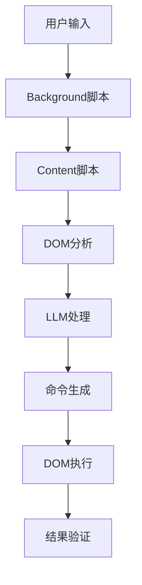

# 智能网页重排器 Chrome 扩展

**中文** | [English](README_EN.md)

基于大语言模型(LLM)的智能网页内容重排工具，能够根据用户需求自动整理网页布局、移除广告和杂乱信息，同时保持所有交互功能完整。

## ✨ 主要功能

- 🤖 **智能重排**: 使用LLM理解用户需求，智能重新安排网页内容
- 🛡️ **功能保护**: 严格保护按钮、链接、表单等交互元素不被破坏
- 🎯 **广告清理**: 自动识别并移除广告、推广内容
- 🎨 **布局优化**: 提供阅读模式、极简模式等快速模板
- ⚙️ **灵活配置**: 支持多种LLM提供商（OpenAI、Anthropic、自定义API）
- 🔄 **一键恢复**: 随时恢复页面到原始状态
- 🌍 **国际化支持**: 支持中英文界面切换
- 🧠 **域名记忆**: 记住每个域名的设置并自动应用
- 🔧 **自动重排**: 根据保存的偏好自动重排页面
- 📋 **历史记录**: 查看和快速选择历史需求记录

## 🚀 安装使用

### 1. 加载扩展
1. 打开 Chrome 浏览器
2. 访问 `chrome://extensions/`
3. 开启"开发者模式"
4. 点击"加载已解压的扩展程序"
5. 选择本项目文件夹

### 2. 配置LLM
1. 点击扩展图标，进入"设置"选项卡
2. 选择LLM提供商：
   - **OpenAI**: 使用 GPT 模型
   - **Anthropic**: 使用 Claude 模型  
   - **自定义**: 配置自己的API地址
3. 输入API密钥和模型名称
4. 点击"测试连接"验证配置

### 3. 开始使用
1. 在任意网页上点击扩展图标
2. 描述您的重排需求，或选择快速模板：
   - **阅读模式**: 专注文章内容，移除侧边栏和广告
   - **极简模式**: 保留核心内容，移除装饰元素
   - **文章专注**: 突出标题正文，隐藏评论推荐
   - **清理广告**: 移除广告内容，保持原有布局
3. 点击"开始重排"
4. 如需恢复，点击"恢复原状"

### 4. 域名记忆功能
1. 成功执行重排后，点击"💾 保存记忆"按钮
2. 扩展会保存当前域名的重排需求和具体修改命令
3. 点击"📋 查看记忆"可以管理所有保存的域名记忆
4. 在设置中启用"自动重排"，访问已保存域名时会自动应用记忆

### 5. 历史记录功能（新增！）
1. 点击需求输入框旁边的"📋"按钮查看历史记录
2. 所有成功执行的重排需求会自动保存
3. 从下拉列表中选择任意历史记录即可快速载入
4. 支持清空所有历史记录
5. 最多保存50条历史记录，按时间倒序显示

## 🔧 技术架构

### 核心组件
- **Manifest V3**: 遵循最新Chrome扩展标准
- **Background Service Worker**: 协调LLM通信和状态管理
- **Content Script**: 执行DOM分析和操作
- **Popup UI**: 用户交互界面，支持国际化
- **国际化系统**: 实时多语言切换支持
- **存储系统**: 域名记忆和历史记录管理

### 关键特性
- **交互元素保护**: 使用多重启发式算法识别并保护交互元素
- **非破坏性操作**: 优先使用CSS隐藏而非删除元素
- **智能选择器**: 生成唯一且稳定的CSS选择器
- **批量处理**: 优化DOM操作性能，避免页面卡顿
- **状态恢复**: 完整保存原始页面状态用于恢复
- **域名智能**: 学习并记住用户对每个域名的偏好
- **历史管理**: 自动保存和管理用户的重排需求历史

### 安全保障
- **最小权限**: 仅使用 `activeTab`, `scripting`, `storage`, `tabs` 权限
- **数据隔离**: 内容脚本在隔离环境中运行
- **输入验证**: 严格验证LLM输出，防止XSS攻击
- **本地存储**: API密钥安全存储在本地

### 数据存储结构

#### 域名记忆 V2.0
```javascript
{
  "domain_config_example.com": {
    "domain": "example.com",
    "prompt": "移除广告，专注内容",
    "commands": [
      {"type": "hide", "selector": ".ad-banner"},
      {"type": "remove", "selector": ".sidebar"},
      {"type": "style", "selector": "#main", "cssProperties": {"width": "100%"}}
    ],
    "version": "2.0",
    "timestamp": 1634567890123
  }
}
```

#### 历史记录
```javascript
{
  "promptHistory": [
    {
      "prompt": "转为阅读模式，移除所有广告",
      "timestamp": 1634567890123
    },
    // ... 更多历史记录
  ]
}
```

## 🔬 技术原理深度解析

### 交互元素检测算法

扩展使用复杂的多层方法识别交互元素：

1. **HTML标签分析**: 识别本质上具有交互性的标签（`<button>`, `<input>`, `<a>` 等）
2. **ARIA角色检测**: 识别表示交互性的无障碍角色
3. **属性扫描**: 检测 `tabindex`, `onclick` 及其他交互相关属性
4. **上下文分析**: 考虑父子关系和布局上下文

```javascript
// 示例启发式选择器
const interactiveSelectors = [
    'button', 'input', 'select', 'textarea', 'a[href]',
    '[onclick]', '[tabindex]', '[role="button"]',
    '[role="link"]', '[role="checkbox"]', // ... 更多
];
```

### DOM操作策略

扩展遵循非破坏性方法：

1. **状态保存**: 在任何更改前捕获完整DOM快照
2. **选择性修改**: 仅修改视觉呈现，不改变结构
3. **CSS优先**: 使用 `display: none` 而非移除元素
4. **批量操作**: 将DOM操作分组以最小化回流

### LLM集成架构



### 域名记忆系统 V2.0

最新版本的域名记忆系统不仅保存用户需求，还保存具体的修改命令：

```javascript
// 保存记忆时的流程
1. 捕获当前页面的修改命令
2. 与用户需求一起保存
3. 应用记忆时直接执行保存的命令
4. 无需重新调用LLM，实现快速应用
```

这种方式的优势：
- **速度快**: 无需重新调用LLM
- **结果一致**: 每次应用效果完全相同
- **成本低**: 减少API调用费用
- **可靠性高**: 不受LLM服务状态影响

### 国际化架构

```javascript
// i18n系统核心
class I18n {
    async init(language) {
        await this.loadMessages(language);
        this.applyTranslations();
    }
    
    t(key, params = {}) {
        return this.interpolate(this.messages[key], params);
    }
}
```

## 📋 支持的LLM提供商

### OpenAI
- **模型**: gpt-3.5-turbo, gpt-4, gpt-4-turbo
- **API地址**: `https://api.openai.com/v1/chat/completions`

### Anthropic  
- **模型**: claude-3-haiku, claude-3-sonnet, claude-3-opus
- **API地址**: `https://api.anthropic.com/v1/messages`

### 自定义API
- 支持任何兼容OpenAI格式的API
- 可配置自定义地址和模型名称

## 🎛️ 配置选项

### LLM设置
- **模型提供商**: 选择API提供商
- **API地址**: 自定义API端点
- **API密钥**: 安全存储的访问密钥
- **模型名称**: 指定使用的模型
- **最大Token数**: 控制API调用成本

### 行为设置
- **语言**: 在中英文界面间切换
- **保留图片**: 是否在重排时保留图片
- **保留链接**: 是否保护所有链接不被修改
- **自动检测内容**: 智能识别页面主要内容区域
- **域名记忆**: 记住每个域名的偏好设置
- **自动重排**: 页面加载时自动应用保存的设置

## 🔒 隐私保护

- ✅ **本地优先**: 扩展在本地处理页面内容
- ✅ **用户控制**: 用户明确触发才会处理页面
- ✅ **数据最小化**: 仅发送必要的页面内容给LLM
- ✅ **透明说明**: 明确告知用户数据处理方式
- ✅ **安全存储**: API密钥加密存储在本地

## 🛠️ 开发说明

### 文件结构
```
web-refactor/
├── manifest.json          # 扩展配置文件
├── popup.html             # 用户界面
├── popup.css              # 界面样式
├── popup.js               # 界面逻辑
├── background.js          # 后台服务
├── content.js             # 内容脚本
├── i18n.js                # 国际化系统
├── locales/               # 语言包
│   ├── en.json            # 英文翻译
│   └── zh.json            # 中文翻译
├── icons/                 # 扩展图标
├── generate_icons.py      # 图标生成脚本
├── README.md              # 中文文档
├── README_EN.md           # 英文文档
└── DEBUG_GUIDE.md         # 调试指南
```

### 主要类
- `WebRefactorPopup`: 用户界面控制器，支持国际化
- `WebRefactorBackground`: 后台协调器，支持自动重排
- `LLMService`: LLM API集成，支持多提供商
- `WebRefactorContent`: 内容脚本主控制器
- `InteractiveElementDetector`: 交互元素识别
- `DOMAnalyzer`: 页面结构分析
- `CommandExecutor`: DOM操作执行器
- `I18n`: 国际化系统
- `HistoryManager`: 历史记录管理（集成在WebRefactorPopup中）

### 开发命令

```bash
# 生成图标文件
python generate_icons.py your_logo.png

# 在Chrome中加载扩展
# 1. 访问 chrome://extensions/
# 2. 开启开发者模式
# 3. 点击"加载已解压的扩展程序"
# 4. 选择项目目录
```

## 📝 更新日志

### v1.2.0 (2024-06-14)
- 📋 新增历史记录功能
- 🚀 优化域名记忆系统至V2.0版本
- 💾 支持保存和复用具体修改命令
- 🎨 改进UI设计，添加历史记录下拉菜单
- ⚡ 提升记忆应用速度

### v1.1.0 (2024-06-13)
- 🌍 新增国际化支持（中英文界面切换）
- 🧠 新增域名记忆功能
- 🔧 新增页面加载时自动重排
- 🎯 改进LLM提示工程
- 🛡️ 增强交互元素保护机制
- 📊 增加详细的技术原理文档

### v1.0.0 (2024-06-13)
- 🎉 首次发布
- ✨ 支持多种LLM提供商
- 🛡️ 完善的交互元素保护机制
- 🎨 内置常用重排模板
- 🔄 完整的状态恢复功能

## 🤝 贡献

欢迎提交Issue和Pull Request来改进这个项目！

## 📄 许可证

MIT License - 详见 LICENSE 文件

## ⚠️ 注意事项

1. **页面限制**: 仅支持 `http://`、`https://` 和 `file://` 页面，不支持 `chrome://` 等浏览器内部页面
2. **API成本**: 使用云端LLM会产生API调用费用，请注意控制使用频率
3. **网站兼容性**: 某些使用复杂JavaScript的网站可能不完全兼容
4. **功能保护**: 虽然已尽力保护交互功能，但在复杂页面上仍可能出现意外情况
5. **定期更新**: 建议定期更新扩展以获得最新功能和安全修复

## 🐛 遇到问题？

### 查看详细日志
1. **Background Script日志** (最重要):
   - 进入 `chrome://extensions/`
   - 找到本扩展，点击"service worker"
   - 在开发者工具Console中查看详细日志

2. **Content Script日志**:
   - 在问题页面按 `F12`
   - 查看Console中的页面操作日志

3. **完整调试指南**: 查看 [DEBUG_GUIDE.md](DEBUG_GUIDE.md)

### 常见问题
- **"不支持的页面类型"**: 请在普通网页上使用，不要在`chrome://`页面
- **"请先配置LLM"**: 在设置中配置API密钥和模型
- **"连接失败"**: 检查网络连接和API配置

### 域名记忆问题
- **自动重排不工作**: 确保同时启用了"域名记忆"和"自动重排"
- **应用了错误设置**: 检查存储中的域名记忆（在控制台日志中可见）
- **性能影响**: 自动重排在页面加载后添加2秒延迟
- **记忆未保存**: 确保在成功执行重排后才点击保存按钮

### 历史记录问题
- **历史记录未显示**: 检查chrome.storage.local权限
- **历史过多**: 系统自动限制为最新50条记录
- **重复记录**: 相同需求只更新时间戳，不会重复保存

---

如有问题或建议，请创建Issue并提供详细的日志信息。