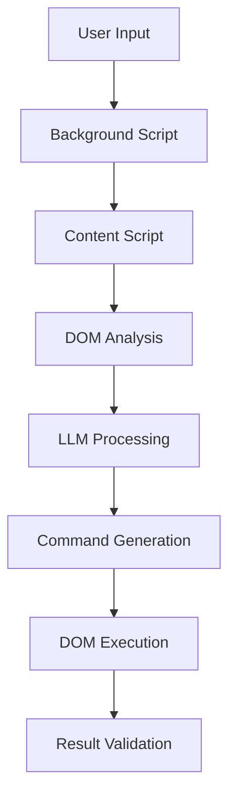

# Smart Web Refactor Chrome Extension

[中文版](README.md) | **English**

An intelligent web content refactoring tool powered by Large Language Models (LLM) that automatically reorganizes webpage layouts, removes ads and clutter while preserving all interactive functionality.

## ✨ Key Features

- 🤖 **Smart Refactoring**: Uses LLM to understand user needs and intelligently rearrange web content
- 🛡️ **Function Protection**: Strictly protects buttons, links, forms, and other interactive elements from being broken
- 🎯 **Ad Cleanup**: Automatically identifies and removes ads and promotional content
- 🎨 **Layout Optimization**: Provides quick templates like Reader Mode, Minimal Mode, etc.
- ⚙️ **Flexible Configuration**: Supports multiple LLM providers (OpenAI, Anthropic, Custom API)
- 🔄 **One-Click Restore**: Restore page to original state anytime
- 🌍 **Internationalization**: Supports English and Chinese languages
- 🧠 **Domain Memory**: Remembers settings for each domain and auto-applies them
- 🔧 **Auto Refactor**: Automatically refactor pages on load based on saved preferences
- 📋 **History Records**: View and quickly select from history of requirements

## 🚀 Installation & Usage

### 1. Load Extension
1. Open Chrome browser
2. Go to `chrome://extensions/`
3. Enable "Developer mode"
4. Click "Load unpacked"
5. Select this project folder

### 2. Configure LLM
1. Click extension icon, go to "Settings" tab
2. Select LLM provider:
   - **OpenAI**: Use GPT models
   - **Anthropic**: Use Claude models  
   - **Custom**: Configure your own API endpoint
3. Enter API key and model name
4. Click "Test Connection" to verify configuration

### 3. Start Using
1. Click extension icon on any webpage
2. Describe your refactoring needs, or select quick templates:
   - **Reader Mode**: Focus on article content, remove sidebars and ads
   - **Minimal Mode**: Keep core content, remove decorative elements
   - **Article Focus**: Highlight title and body, hide comments and recommendations
   - **Clean Ads**: Remove ads while maintaining original layout
3. Click "Start Refactor"
4. Use "Restore Original" to revert changes if needed

### 4. Domain Memory
1. After successful refactoring, click "💾 Save Memory" button
2. Extension saves the current domain's refactor requirements and specific modification commands
3. Click "📋 View Memories" to manage all saved domain memories
4. Enable "Auto Refactor" in settings to automatically apply memories when visiting saved domains

### 5. History Records (New!)
1. Click the "📋" button next to the requirements input box to view history
2. All successfully executed refactor requirements are automatically saved
3. Select any history record from the dropdown to quickly load it
4. Support for clearing all history records
5. Stores up to 50 history records, displayed in reverse chronological order

## 🔧 Technical Architecture

### Core Components
- **Manifest V3**: Follows latest Chrome extension standards
- **Background Service Worker**: Coordinates LLM communication and state management
- **Content Script**: Executes DOM analysis and manipulation
- **Popup UI**: User interaction interface
- **Internationalization System**: Multi-language support with real-time switching
- **Storage System**: Domain memory and history records management

### Key Features
- **Interactive Element Protection**: Uses multiple heuristic algorithms to identify and protect interactive elements
- **Non-destructive Operations**: Prioritizes CSS hiding over element removal
- **Smart Selectors**: Generates unique and stable CSS selectors
- **Batch Processing**: Optimizes DOM operations to prevent page lag
- **State Recovery**: Completely saves original page state for restoration
- **Domain Intelligence**: Learns and remembers user preferences per domain
- **History Management**: Automatically saves and manages user refactor requirement history

### Security Measures
- **Minimal Permissions**: Only uses `activeTab`, `scripting`, `storage`, and `tabs` permissions
- **Data Isolation**: Content scripts run in isolated environment
- **Input Validation**: Strictly validates LLM output to prevent XSS attacks
- **Local Storage**: API keys stored securely locally

## 📋 Supported LLM Providers

### OpenAI
- **Models**: gpt-3.5-turbo, gpt-4, gpt-4-turbo
- **API URL**: `https://api.openai.com/v1/chat/completions`

### Anthropic  
- **Models**: claude-3-haiku, claude-3-sonnet, claude-3-opus
- **API URL**: `https://api.anthropic.com/v1/messages`

### Custom API
- Supports any OpenAI-compatible API
- Configurable custom endpoints and model names

## 🎛️ Configuration Options

### LLM Settings
- **Model Provider**: Choose API provider
- **API URL**: Custom API endpoint
- **API Key**: Securely stored access key
- **Model Name**: Specify model to use
- **Max Tokens**: Control API call costs

### Behavior Settings
- **Language**: Switch between English and Chinese
- **Preserve Images**: Whether to preserve images during refactoring
- **Preserve Links**: Whether to protect all links from modification
- **Auto-detect Content**: Intelligently identify main content areas
- **Domain Memory**: Remember preferences for each domain
- **Auto Refactor**: Automatically refactor pages based on saved preferences

## 🔒 Privacy Protection

- ✅ **Local First**: Extension processes page content locally
- ✅ **User Control**: Only processes pages when explicitly triggered by user
- ✅ **Data Minimization**: Only sends necessary page content to LLM
- ✅ **Transparent Disclosure**: Clearly informs users about data processing
- ✅ **Secure Storage**: API keys encrypted and stored locally

## 🔬 Technical Deep Dive

### Interactive Element Detection Algorithm

The extension uses a sophisticated multi-layered approach to identify interactive elements:

1. **HTML Tag Analysis**: Identifies inherently interactive tags (`<button>`, `<input>`, `<a>`, etc.)
2. **ARIA Role Detection**: Recognizes accessibility roles that indicate interactivity
3. **Attribute Scanning**: Detects `tabindex`, `onclick`, and other interaction-related attributes
4. **Contextual Analysis**: Considers parent-child relationships and layout context

```javascript
// Example heuristic selectors
const interactiveSelectors = [
    'button', 'input', 'select', 'textarea', 'a[href]',
    '[onclick]', '[tabindex]', '[role="button"]',
    '[role="link"]', '[role="checkbox"]', // ... more
];
```

### DOM Manipulation Strategy

The extension follows a non-destructive approach:

1. **State Preservation**: Captures complete DOM snapshot before any changes
2. **Selective Modification**: Only modifies visual presentation, not structure
3. **CSS-First Approach**: Uses `display: none` instead of removing elements
4. **Batch Operations**: Groups DOM operations to minimize reflows

### LLM Integration Architecture



### Data Storage Structure

#### Domain Memory V2.0
```javascript
{
  "domain_config_example.com": {
    "domain": "example.com",
    "prompt": "Remove ads and focus on content",
    "commands": [
      {"type": "hide", "selector": ".ad-banner"},
      {"type": "remove", "selector": ".sidebar"},
      {"type": "style", "selector": "#main", "cssProperties": {"width": "100%"}}
    ],
    "version": "2.0",
    "timestamp": 1634567890123
  }
}
```

#### History Records
```javascript
{
  "promptHistory": [
    {
      "prompt": "Convert to reader mode, remove all ads",
      "timestamp": 1634567890123
    },
    // ... more history records
  ]
}
```

### Domain Memory System V2.0

The latest version of the domain memory system saves not only user requirements but also specific modification commands:

```javascript
// Memory saving workflow
1. Capture current page modification commands
2. Save together with user requirements
3. Apply saved commands directly when applying memory
4. No need to call LLM again, achieving fast application
```

Advantages of this approach:
- **Fast Speed**: No need to call LLM again
- **Consistent Results**: Same effect every time
- **Low Cost**: Reduces API call fees
- **High Reliability**: Not affected by LLM service status

## 🛠️ Development Guide

### File Structure
```
web-refactor/
├── manifest.json          # Extension configuration
├── popup.html             # User interface
├── popup.css              # Interface styles
├── popup.js               # Interface logic
├── background.js          # Background service
├── content.js             # Content script
├── i18n.js                # Internationalization
├── locales/               # Language files
│   ├── en.json            # English translations
│   └── zh.json            # Chinese translations
├── icons/                 # Extension icons
├── generate_icons.py      # Icon generation script
├── README.md              # Chinese documentation
├── README_EN.md           # English documentation
└── DEBUG_GUIDE.md         # Debugging guide
```

### Main Classes
- `WebRefactorPopup`: User interface controller with i18n support
- `WebRefactorBackground`: Background coordinator with auto-refactor
- `LLMService`: LLM API integration with multiple providers
- `WebRefactorContent`: Content script main controller
- `InteractiveElementDetector`: Interactive element identification
- `DOMAnalyzer`: Page structure analysis
- `CommandExecutor`: DOM operation executor
- `I18n`: Internationalization system
- `HistoryManager`: History records management (integrated in WebRefactorPopup)

### Development Commands

```bash
# Generate icons from source image
python generate_icons.py your_logo.png

# Load extension in Chrome
# 1. Go to chrome://extensions/
# 2. Enable Developer mode
# 3. Click "Load unpacked"
# 4. Select project directory
```

## 📝 Changelog

### v1.2.0 (2024-06-14)
- 📋 Added history records functionality
- 🚀 Optimized domain memory system to V2.0
- 💾 Support for saving and reusing specific modification commands
- 🎨 Improved UI design, added history records dropdown
- ⚡ Enhanced memory application speed

### v1.1.0 (2024-06-13)
- 🌍 Added internationalization support (English/Chinese)
- 🧠 Added domain memory functionality
- 🔧 Added auto refactor on page load
- 🎯 Improved LLM prompt engineering
- 🛡️ Enhanced interactive element protection

### v1.0.0 (2024-06-13)
- 🎉 Initial release
- ✨ Multiple LLM provider support
- 🛡️ Comprehensive interactive element protection
- 🎨 Built-in refactor templates
- 🔄 Complete state restoration

## 🤝 Contributing

Welcome to submit Issues and Pull Requests to improve this project!

## 📄 License

MIT License - See LICENSE file for details

## ⚠️ Important Notes

1. **Page Limitations**: Only supports `http://`, `https://`, and `file://` pages, not `chrome://` browser internal pages
2. **API Costs**: Using cloud LLMs incurs API call costs, please control usage frequency
3. **Website Compatibility**: Some websites with complex JavaScript may not be fully compatible
4. **Function Protection**: While we try our best to protect interactive functions, unexpected issues may still occur on complex pages
5. **Regular Updates**: Recommend updating the extension regularly for latest features and security fixes

## 🐛 Troubleshooting

### View Detailed Logs
1. **Background Script Logs** (Most Important):
   - Go to `chrome://extensions/`
   - Find this extension, click "service worker"
   - View detailed logs in Developer Tools Console

2. **Content Script Logs**:
   - Press `F12` on the problem page
   - Check Console for page operation logs

3. **Complete Debugging Guide**: See [DEBUG_GUIDE.md](DEBUG_GUIDE.md)

### Common Issues
- **"Unsupported page type"**: Use on regular webpages, not on `chrome://` pages
- **"Please configure LLM"**: Configure API key and model in settings
- **"Connection failed"**: Check network connection and API configuration

### Domain Memory Issues
- **Auto refactor not working**: Ensure both "Domain Memory" and "Auto Refactor" are enabled
- **Wrong settings applied**: Check the domain memory in storage (visible in console logs)
- **Performance impact**: Auto refactor adds a 2-second delay after page load
- **Memory not saved**: Ensure you click save button after successful refactoring

### History Records Issues
- **History not showing**: Check chrome.storage.local permissions
- **Too many history items**: System automatically limits to 50 records
- **Duplicate records**: Same requirements only update timestamp, won't save duplicates

---

If you have questions or suggestions, please create an Issue with detailed log information.