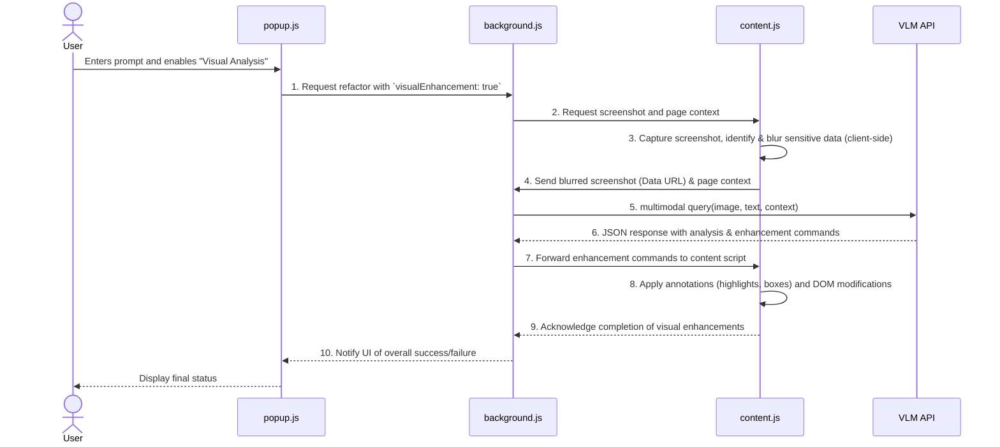

# Technical Design: Multimodal Visual Enhancement

## 1. High-Level Architecture

The multimodal visual enhancement feature integrates into the existing extension architecture by introducing a new workflow orchestrated by the background script. The core components (`popup.js`, `background.js`, `content.js`) will interact to capture, analyze, and render visual information. A new service, the Vision-Language Model (VLM) API, will be called by the background script to perform the intelligent analysis.



## 2. Data Flow

1.  **User Interaction**: The user enters a text prompt in the popup UI and enables the "Visual Enhancement" feature via a toggle/checkbox.
2.  **Request Initiation**: `popup.js` sends a message to `background.js` with the action `refactor`, the user's prompt, and a new flag `visualEnhancement: true`.
3.  **Screenshot Request**: `background.js` receives the request and, recognizing the `visualEnhancement` flag, sends a message to `content.js` requesting a screenshot of the visible tab.
4.  **Client-Side Capture & Privacy**: `content.js`, running on the active page, captures the visible area of the page. Before sending the image data, it performs a crucial privacy step: it identifies and blurs sensitive information (e.g., text in password fields, content matching PII regex) directly on the captured image canvas.
5.  **Data Transmission to Background**: `content.js` sends the blurred screenshot, encoded as a Base64 Data URL, along with a summary of the page's DOM structure (re-using the existing `extractContent` logic) back to `background.js`.
6.  **VLM Analysis**: `background.js` forwards the blurred screenshot, the user's text prompt, and the DOM context to the configured VLM API endpoint.
7.  **Receiving Instructions**: The VLM processes the multimodal input and returns a JSON object containing both textual analysis and a list of specific enhancement commands (e.g., `draw_box`, `highlight`, `add_text_annotation`).
8.  **Applying Enhancements**: `background.js` parses the VLM response and sends the enhancement commands to `content.js`.
9.  **Rendering on Page**: `content.js` executes these commands by creating an overlay canvas on top of the webpage. It draws the required annotations (boxes, arrows, highlights) on this canvas, ensuring the original page DOM is not destructively modified. Any DOM manipulations (like `remove` or `style`) are handled by the existing `CommandExecutor`.
10. **Completion**: `content.js` confirms completion to `background.js`, which then relays the final status to the popup UI.

## 3. Component Responsibilities

*   **`popup.js`**
    *   **UI**: Add a new checkbox/toggle element to `popup.html` to enable the visual enhancement feature.
    *   **Interaction**: When the "Refactor" button is clicked, check the state of the new toggle. If enabled, include `visualEnhancement: true` and the selected screenshot quality in the message sent to `background.js`.

*   **`background.js`**
    *   **Orchestration**: Modify the `handleRefactor` message handler. If `visualEnhancement` is true, it must orchestrate the new data flow: get the screenshot from `content.js`, call the VLM, and send enhancement commands back to `content.js`.
    *   **VLM Service Integration**: The `LLMService` class will be expanded into a more generic `AIService`. It will contain a new method `callVLM(messages, image_data)` which constructs and sends the multimodal request to the vision-capable model endpoint. The existing `callLLM` will be for text-only requests.
    *   **State Management**: Continues to manage the application state, including original page state for reset functionality.

*   **`content.js`**
    *   **Screenshot & Blurring**: Implement a new message handler for `capturePageWithPrivacy`. This will use a library like `html2canvas` to draw the DOM to a canvas. It will then scan the canvas for text matching sensitive patterns and apply a blur filter to those regions before exporting the canvas as a JPEG Data URL.
    *   **Annotation Rendering**: Implement a handler for a new message action, `applyEnhancements`. This function will create a full-page `<canvas>` overlay with a high z-index. It will then parse an array of enhancement commands (e.g., `{'type': 'draw_box', 'coordinates': [x, y, w, h], 'color': 'red'}`) and draw them onto the canvas.
    *   **DOM Manipulation**: The existing `CommandExecutor` will continue to handle any direct DOM modification commands returned by the VLM.

## 4. API & Data Models

### 4.1. Inter-Component Messaging

*   **`popup.js` -> `background.js`**
    ```json
    {
      "action": "refactor",
      "tabId": 123,
      "prompt": "Show me where the login button is.",
      "visualEnhancement": true,
      "screenshotQuality": 0.9 
    }
    ```

*   **`background.js` -> `content.js` (Annotations)**
    ```json
    {
      "action": "applyEnhancements",
      "commands": [
        {
          "type": "draw_box",
          "coordinates": { "x": 150, "y": 200, "width": 100, "height": 40 },
          "style": { "color": "rgba(255, 0, 0, 0.8)", "lineWidth": 2 }
        },
        {
          "type": "add_text",
          "coordinates": { "x": 155, "y": 190 },
          "text": "Login Button",
          "style": { "font": "16px Arial", "color": "white", "backgroundColor": "red" }
        }
      ]
    }
    ```

### 4.2. Vision-Language Model (VLM) API

*   **Request (to VLM)**: Following OpenAI's format for multimodal requests.
    ```json
    {
      "model": "gpt-4-vision-preview",
      "messages": [
        {
          "role": "user",
          "content": [
            { "type": "text", "text": "User Prompt: Highlight the main call-to-action button. Page Context: { ...JSON... }" },
            { 
              "type": "image_url",
              "image_url": {
                "url": "data:image/jpeg;base64,..."
              }
            }
          ]
        }
      ],
      "max_tokens": 1000
    }
    ```

*   **Response (from VLM)**
    ```json
    {
      "choices": [{
        "message": {
          "role": "assistant",
          "content": "{\"text_response\": \"The main call-to-action is the 'Sign Up Free' button.\", \"enhancements\": [{\"type\": \"draw_box\", \"coordinates\": {\"x\": 520, \"y\": 340, \"width\": 150, \"height\": 50}, \"style\": {\"color\": \"blue\"}}]}"
        }
      }]
    }
    ```

## 5. Privacy & Security

Privacy is a critical requirement. The implementation will follow a "privacy-by-design" approach by performing all sensitive data handling on the client-side.

1.  **Client-Side Processing**: The screenshot will be captured and processed entirely within the `content.js` script, running in the user's browser. The raw, un-blurred screenshot will **never** be transmitted outside the content script's memory.
2.  **Sensitive Data Identification**: `content.js` will scan the DOM *before* taking the screenshot to identify potentially sensitive elements. This includes:
    *   Inputs with `type="password"`.
    *   Inputs/elements whose `id`, `name`, or `class` attributes suggest sensitive content (e.g., `credit-card`, `ssn`, `cvc`).
3.  **Regex-Based Blurring**: After rendering the DOM to a canvas, the script will use OCR or text-coordinate mapping to find and blur text matching common PII patterns (e.g., email addresses, phone numbers, credit card numbers, etc.).
4.  **User Consent**: As per the PRD, the first time the feature is used, a clear modal dialog will explain what data is being captured and sent for analysis, requiring explicit user consent.

## 6. Key Dependencies

*   **`html2canvas`**: A library to accurately capture a screenshot of the current page's DOM by rendering it to a canvas. This is more robust than `chrome.tabs.captureVisibleTab` as it can capture the entire page and interact with the DOM elements for blurring.
*   **A lightweight OCR library (optional but recommended)**: A small, client-side OCR library (like Tesseract.js, though a lighter alternative would be preferred) could be used to identify text on the canvas for more accurate blurring if simple coordinate mapping is insufficient.
*   **No new server-side dependencies**: The extension will continue to rely on the user-configured LLM provider endpoint. No new backend infrastructure is required for this feature.